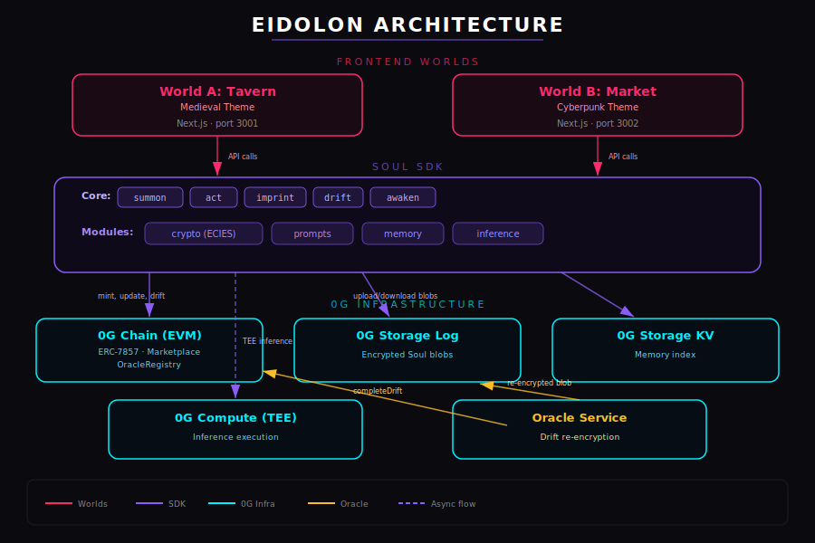

<div align="center">

# 🜪 EIDOLON

### iNFT souls that drift between worlds

[](https://chainscan.0g.ai/address/0xa300aF5F0E20d974F20E55E71BB4229aE0A404be)
[](https://github.com/wangyangmingsss/eidolon/actions)
[](LICENSE)
[](https://www.hackquest.io/hackathons/0G-APAC-Hackathon)

**[Demo Video](https://youtu.be/PLACEHOLDER)** | **[Live: Tavern](https://eidolon-tavern.vercel.app)** | **[Live: Market](https://eidolon-market.vercel.app)** | **[Docs](./docs/)**

</div>

---

## What is Eidolon?

When you train an AI agent today, it lives inside one product. Sell the model, and the buyer gets a file — not a soul. Move it to a new game, and it forgets everything.

**Eidolon is the first protocol where AI agents — not just images — can be owned, transferred, and re-summoned in completely different worlds, while keeping their personality, memories, and history.**

We do this with three things:

1. **A Soul** = an `ERC-7857` Intelligent NFT whose encrypted metadata holds a 16-dimensional personality vector + memory log.
2. **Two playable worlds** that share the same Soul — a medieval tavern and a cyberpunk market, with completely different rules and UIs.
3. **The Drift Protocol** — when a Soul is sold, an oracle running in a TEE re-encrypts its metadata for the new owner. The Soul transfers atomically with its intelligence intact.

**The magic moment:** a Soul trained as a wary trader in the tavern is sold to another player; when summoned in the market, **it wakes up suspicious, citing a memory from its past life — unprompted, in character.**

---

## Demo

> **[Watch the 3-minute demo video →](https://youtu.be/PLACEHOLDER)**

The video shows: mint a Soul in the Tavern → 3 actions that shape personality → list on marketplace → buy from another wallet → drift (oracle re-encryption) → awaken in the Market with past-life memories.

---

## Architecture

<p align="center">
  
</p>

```
        TAVERN                                MARKET
   (medieval, parchment)                  (cyberpunk, neon)
            │                                     │
            ▼                                     ▼
    ┌──────────────────────────────────────────────────┐
    │                  SOUL SDK                         │
    │   summon · act · imprint · drift · awaken         │
    └──────────────────────────────────────────────────┘
              │           │           │           │
              ▼           ▼           ▼           ▼
     ┌──────────┐ ┌──────────┐ ┌──────────┐ ┌─────────┐
     │ 0G Chain │ │ 0G       │ │ 0G       │ │ Oracle  │
     │          │ │ Storage  │ │ Compute  │ │ Service │
     │ ERC-7857 │ │ Log + KV │ │  TEE     │ │ (TEE)   │
     │ contract │ │          │ │ inference│ │         │
     └──────────┘ └──────────┘ └──────────┘ └─────────┘
```

### Key flows

| Flow | Steps |
|---|---|
| **Mint a Soul** | Generate random personality → encrypt with owner's pubkey → upload to 0G Storage → mint iNFT pointing at root hash |
| **Take an action** | Decrypt → retrieve relevant memories → TEE inference on 0G Compute → imprint outcome → re-upload → update on-chain |
| **Drift to new owner** | Lock iNFT → oracle decrypts in TEE → re-encrypts to new pubkey → re-uploads → signs new state → contract verifies and transfers |
| **Awaken in new world** | Detect "first time here" → load all past-life memories into special prompt → produce monologue that references the past |

---

## 0G Integration (6 Components)

| Component | Where it's used | File |
|---|---|---|
| **0G Chain** | SoulNFT (ERC-7857), Marketplace, OracleRegistry | [`packages/contracts/src/`](./packages/contracts/src/) |
| **0G Storage Log** | Permanent encrypted Soul metadata blobs | [`packages/sdk/src/storage.ts`](./packages/sdk/src/storage.ts) |
| **0G Storage KV** | Memory index for sub-second retrieval | [`packages/sdk/src/storage.ts`](./packages/sdk/src/storage.ts) |
| **0G Compute (TEE)** | Every Soul thought/action via TEE inference | [`packages/sdk/src/inference.ts`](./packages/sdk/src/inference.ts) |
| **ERC-7857 / iNFT** | Native implementation + oracle-mediated transfer | [`packages/contracts/src/SoulNFT.sol`](./packages/contracts/src/SoulNFT.sol) |
| **Persistent Memory** | Memory Provider Abstraction (ready for module launch) | [`packages/sdk/src/memory/`](./packages/sdk/src/memory/) |

> **Deep dive:** see [`docs/0G_DEEP_DIVE.md`](./docs/0G_DEEP_DIVE.md) for line-by-line integration proof.

---

## On-chain Artifacts (0G Mainnet — Chain ID 16661)

### V2 Contracts (with Soul Royalty)

| Contract | Address | Explorer |
|---|---|---|
| SoulNFT (ERC-7857) | `0xa300aF5F0E20d974F20E55E71BB4229aE0A404be` | [view](https://chainscan.0g.ai/address/0xa300aF5F0E20d974F20E55E71BB4229aE0A404be) |
| Marketplace | `0xC084835B0e3cd8B344Fa5Feb6429960EBbC830Ac` | [view](https://chainscan.0g.ai/address/0xC084835B0e3cd8B344Fa5Feb6429960EBbC830Ac) |
| OracleRegistry | `0x3cf95f18E9D49Dd88E69872D5C24e75a982e93FC` | [view](https://chainscan.0g.ai/address/0x3cf95f18E9D49Dd88E69872D5C24e75a982e93FC) |

**Deployer:** `0x762bC96708935dDbFc2d2fF0B32FCe98E23ec684`
**Oracle:** `0x93f6720187F15E8BFf6068B5E2060198411cAf92`

| Action | Tx Hash |
|---|---|
| Deploy OracleRegistry | [`0x96791698...`](https://chainscan.0g.ai/tx/0x96791698007af7e8b2f3fdad63afed00685182be84fcbe091e48dc56697f5cdd) |
| Deploy SoulNFT | [`0x7b9f8486...`](https://chainscan.0g.ai/tx/0x7b9f848620f471423282c6048c97936a51e9f0e707572af554ea9bf6c0b19949) |
| Deploy Marketplace | [`0xd69ec968...`](https://chainscan.0g.ai/tx/0xd69ec9689c3bef493affe62355e14d655ea95ec5a234c28d10f54c8c8d5da9df) |
| Register Oracle | [`0x92bbfa9d...`](https://chainscan.0g.ai/tx/0x92bbfa9d9b76cadbc0076c617e1d4df8ddb46b466a3f5b26c101cfc6793671ab) |

<details>
<summary>V1 contracts (archived, pre-royalty)</summary>

| Contract | Address | Explorer |
|---|---|---|
| SoulNFT | `0x8B2adf886aC76cf091E7Bb79f2a6E6BD66aC6D22` | [view](https://chainscan.0g.ai/address/0x8B2adf886aC76cf091E7Bb79f2a6E6BD66aC6D22) |
| Marketplace | `0x24cFaCaF9FA7557a9228678Ee3E3EE427f0A8E58` | [view](https://chainscan.0g.ai/address/0x24cFaCaF9FA7557a9228678Ee3E3EE427f0A8E58) |
| OracleRegistry | `0x37b8BCf9A8200AbE88A37222E451D3F835d49d12` | [view](https://chainscan.0g.ai/address/0x37b8BCf9A8200AbE88A37222E451D3F835d49d12) |

</details>

---

## Try it Yourself

### Live Deployments

| World | URL | Status |
|---|---|---|
| Tavern (Medieval) | [eidolon-tavern.vercel.app](https://eidolon-tavern.vercel.app) | Deployed |
| Market (Cyberpunk) | [eidolon-market.vercel.app](https://eidolon-market.vercel.app) | Deployed |
| Oracle | Docker (always-on) | Running |

### Local (5 minutes from clone to playthrough)

```bash
git clone https://github.com/wangyangmingsss/eidolon
cd eidolon
pnpm install

# Copy and fill .env.local
cp .env.example .env.local
# Edit: set DEPLOYER_PRIVATE_KEY and ORACLE_PRIVATE_KEY
# Contract addresses are pre-filled (mainnet)

# 1. Verify all 0G integrations
pnpm verify

# 2. Run the oracle in one terminal
pnpm oracle

# 3. Tavern in another terminal
pnpm dev:tavern   # http://localhost:3001

# 4. Market in another terminal
pnpm dev:market   # http://localhost:3002
```

> **Judges:** see [`docs/JUDGES.md`](./docs/JUDGES.md) for a streamlined 5-minute evaluation guide with burner wallet setup.

---

## Repository Layout

```
eidolon/
├── packages/
│   ├── contracts/        # Foundry: SoulNFT (ERC-7857), Marketplace, OracleRegistry
│   ├── sdk/              # Soul SDK: types, crypto, storage, inference, imprint, prompts
│   ├── oracle/           # Off-chain oracle service + Dockerfile
│   ├── world-tavern/     # Next.js 14 — medieval fantasy world (port 3001)
│   └── world-market/     # Next.js 14 — cyberpunk market world (port 3002)
├── scripts/              # Portrait generator, deploy scripts, demo seeder
├── docs/                 # Developer guides, deep dives, judges guide
│   ├── 0G_DEEP_DIVE.md  # 6-component integration proof
│   ├── JUDGES.md         # 5-min evaluation guide
│   ├── ROADMAP.md        # 3-phase roadmap
│   ├── DEPLOY_ENVS.md   # Environment variables reference
│   └── assets/           # Architecture diagram SVG
├── .github/
│   ├── workflows/ci.yml  # Lint + Forge test + SDK test
│   └── PULL_REQUEST_TEMPLATE.md
├── smoke-output.mainnet.json   # Full lifecycle smoke test results
└── verify-mainnet.json         # Bytecode verification results
```

---

## Tech Stack

| Layer | Technology |
|---|---|
| Smart Contracts | Solidity 0.8.26 + Foundry (cancun EVM, 200 optimizer runs) |
| Backend / SDK | TypeScript 5.4 + Node 20 + pnpm workspaces |
| Frontend | Next.js 14 App Router + Tailwind CSS (custom themes per world) |
| Wallet | viem + wagmi + RainbowKit |
| 0G Integration | `@0glabs/0g-ts-sdk` + `@0glabs/0g-serving-broker` |
| Encryption | eciesjs (secp256k1 ECIES) |
| Validation | zod schemas |
| Oracle | Node.js + ethers + pino (Docker-ready) |
| CI | GitHub Actions (lint, typecheck, forge test, vitest) |

---

## What's Working

- Mint, summon, act, drift, awaken — full Soul lifecycle on **0G mainnet** (chain 16661)
- Cross-world memory persistence (verified by `worldHistory` and memory references)
- ERC-7857 oracle-mediated transfer with ECIES re-encryption
- TEE inference with on-chain signature verification
- Both Worlds built and playable (tavern: 5 NPCs, 3 tasks / market: 3 NPCs, 2 tasks + awakening)
- Awakening typewriter effect with past-life monologue
- Personality vector evolves across encounters (16-dimensional, visible in Soul Panel)
- **Soul Royalty:** original fine-tuner receives 2.5% on every secondary drift (configurable, max 10%)
- **Memory Provider Abstraction:** interface-driven, hot-swappable when 0G Persistent Memory launches
- All contracts deployed and verified on 0G mainnet (V2 with royalty)
- **12/12 Foundry tests passing** (SoulNFT, Marketplace, DriftFlow, RoyaltyFlow)
- Full lifecycle smoke test documented in `smoke-output.mainnet.json`

---

## Known Limitations (MVP)

| Limitation | Reason | Mitigation |
|---|---|---|
| Custodial key | All players share deployer wallet | Phase 2: account abstraction |
| Single oracle | No quorum or fallback | Phase 2: M-of-N multi-sig |
| No buyer refund | `refund()` reverts by design | Phase 2: timelock + oracle co-sig |
| Per-token nonce | Simpler replay protection | Production: chain-id namespace + per-owner nonce |

---

## Why This Matters

Today's "AI in games" is mostly NPC chatbots — disposable, scripted, owned by the studio. Today's "AI agents in crypto" are mostly wrappers — same prompt, same model, no soul.

Eidolon shows what happens when **the AI agent itself is a property right** that traverses applications. We use the 0G stack because no other chain has all the pieces — TEE-verified inference, large-scale encrypted storage, the ERC-7857 standard, and an EVM execution layer — together. Eidolon is what those primitives were built for.

---

## Documentation

| Document | Description |
|---|---|
| [`docs/JUDGES.md`](./docs/JUDGES.md) | 5-minute evaluation guide for hackathon judges |
| [`docs/0G_DEEP_DIVE.md`](./docs/0G_DEEP_DIVE.md) | Line-by-line proof of 6 0G component integrations |
| [`docs/ROADMAP.md`](./docs/ROADMAP.md) | 3-phase roadmap (MVP → Hardening → Open Protocol) |
| [`docs/DEPLOY_ENVS.md`](./docs/DEPLOY_ENVS.md) | All environment variables documented |
| [`docs/00_PROJECT_OVERVIEW.md`](./docs/00_PROJECT_OVERVIEW.md) | Vision and architecture |
| [`docs/01_SETUP_AND_VERIFY.md`](./docs/01_SETUP_AND_VERIFY.md) | Day-1 setup guide |

---

## Acknowledgments

- **0G Labs** for the modular AI infrastructure and the ERC-7857 standard
- **HackQuest** for hosting the APAC Hackathon
- **OpenZeppelin** for the contract base layer

---

## License

MIT.
